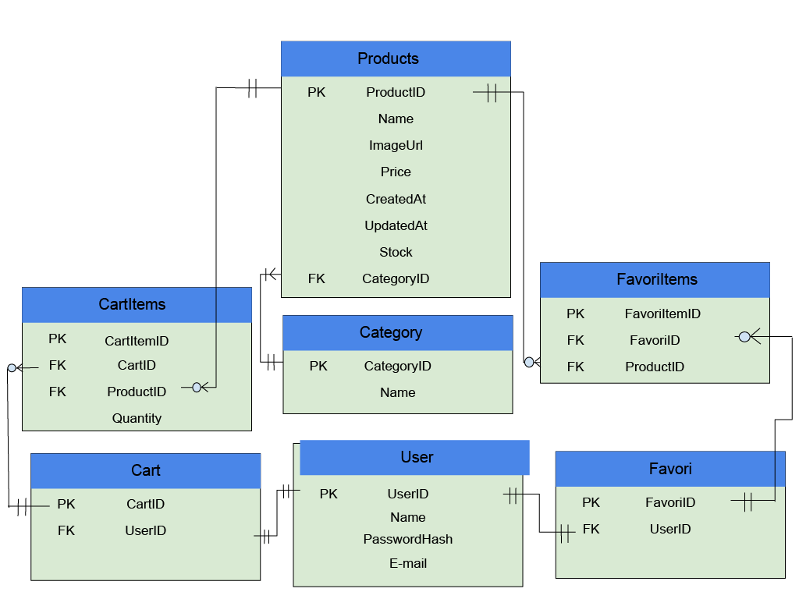

# OnlineStore
Multi-category e-commerce web app using SQL, HTML, CSS, and JavaScript

## Technologies

- HTML
- CSS
- JavaScript
- Bootstrap
- SQL Server
- ASP.NET Core (yakında)

### Business Rules

- Every user has exactly one favorites list.
- Every user has exactly one shopping cart.
- Each product belongs to one category.
- One category can contain multiple products.
- Each CartItem contains exactly one product.
- Each FavoriteItem contains exactly one product.
- One cart can contain zero or more cart items.
- One favorites list can contain zero or more favorite items.
- A product can be added multiple times to a cart (using Quantity).
- The same product can only be added once to the same favorites list.

ER Dİyagram:
